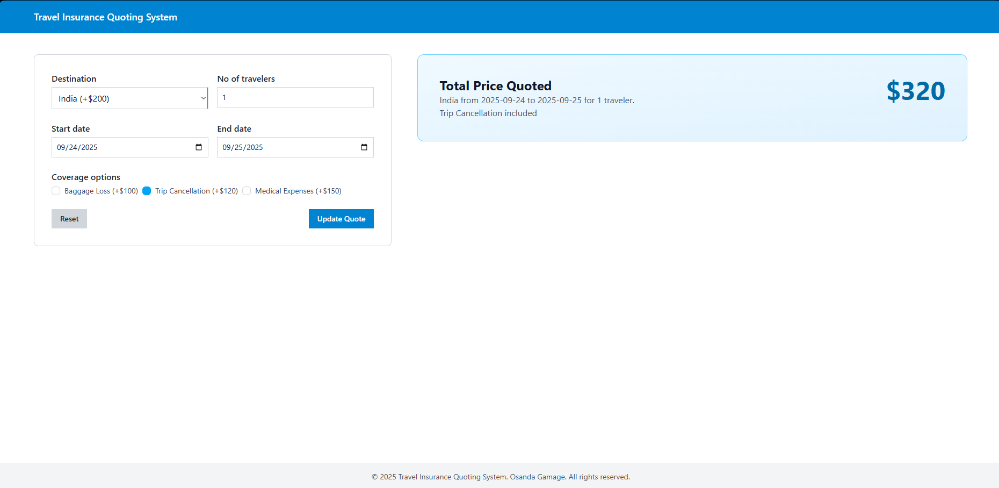
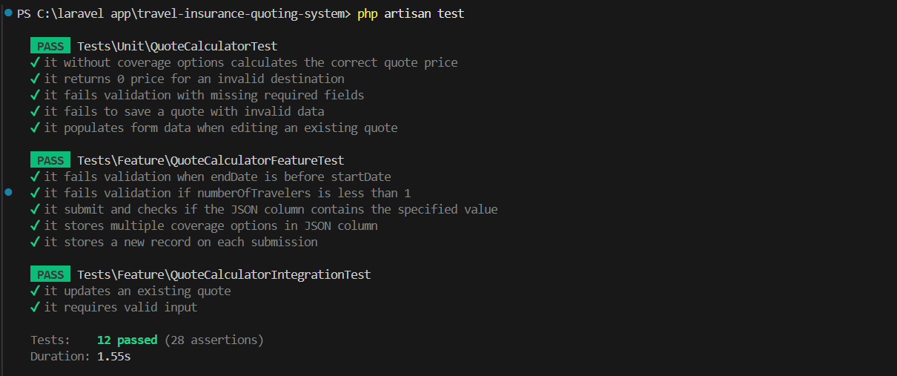

# Basic Travel Insurance Quoting System

Stack : **Livewire**, **Laravel** and **MySQL**

---

## Prerequisites
Ensure you have the following installed:
- PHP <= 8.3
- Laravel 12
- Composer
- Node.js <= 22
- MySQL

---

## Features
- Dynamic form to calculate travel insurance quotes.
- Validation for input fields such as dates, destination, and travelers.
- Reset functionality for clearing forms.
- Quote price calculation based on selected destination and coverage options.
- Quote editing and updating.
- Responsive UI with Tailwind CSS.

---

## How to Installation

### Step 1: Clone the Repository
```bash
git clone https://github.com/ozandabb/travel-insurance-quoting-system.git
cd travel-insurance-quoting-system
```
### Step 2: Install PHP Dependencies
```bash
composer install
```
### Step 3: Install Node.js Dependencies
```bash
npm install
```
### Step 4: Set Up Environment File
Duplicate the `.env.example` file and rename it to `.env`
Configure your database credentials:
```bash
DB_CONNECTION=mysql
DB_HOST=127.0.0.1
DB_PORT=3306
DB_DATABASE=travel_insurance_db
DB_USERNAME=YOUR_USERNAME
DB_PASSWORD=YOUR_PASSWORD
```
### Step 5: Generate Application Key
```bash
php artisan key:generate
```
### Step 6: Run Migrations
```bash
php artisan migrate
```
### Step 7: Start the Application
```bash
php artisan serve
npm run dev
```
### Step 8: Open your browser and visit
```bash
http://127.0.0.1:8000/
```
### Step 9: Testing
```bash
php artisan test
```

---

## Screenshots





